# Behavioral Design Patterns

Behavioral design patterns identify common communication patterns between objects and realize these patterns. By doing so, these patterns increase flexibility in carrying out communication.

---

## 🛠️ Included Patterns

### 1. [Strategy](./Strategy/StrategyPattern)
* **Intent:** Defines a family of algorithms, encapsulates each one, and makes them interchangeable. Strategy lets the algorithm vary independently from clients that use it.
* **Real-World Billing Use-case:** Payment processing. A checkout system allows payments via Credit Card, PayPal, or Crypto. Each algorithm implements a `PaymentStrategy` interface and can be injected dynamically at runtime.
* **Key Classes:**
  - `PaymentStrategy` (Strategy interface)
  - `CreditCardStrategy`, `PaypalStrategy` (Concrete Strategies)
  - `ShoppingCart` (Context)
  - `Item` (Data element)

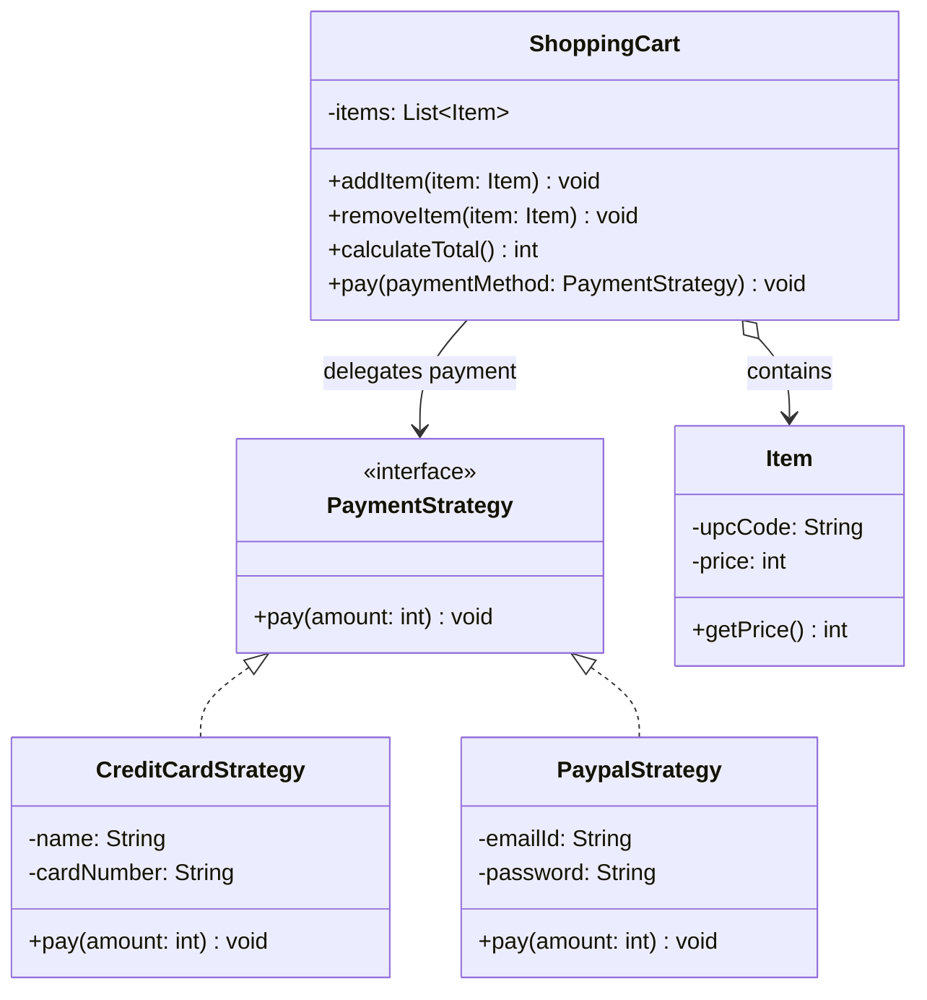

---

### 2. [Observer](./Observer/ObserverPattern)
* **Intent:** Defines a one-to-many dependency between objects so that when one object changes state, all its dependents are notified and updated automatically.
* **Real-World Billing Use-case:** Event notifications. When an invoice status changes to `PAID`, multiple observers (Accounting Ledger, Inventory Manager, Shipping System, Customer Notification Service) react to the event.
* **Key Classes:**
  - `Subject`, `Observer` (Interfaces)
  - `WeatherData` (Concrete Subject)
  - `CurrentConditionsDisplay`, `ForecastDisplay` (Concrete Observers)

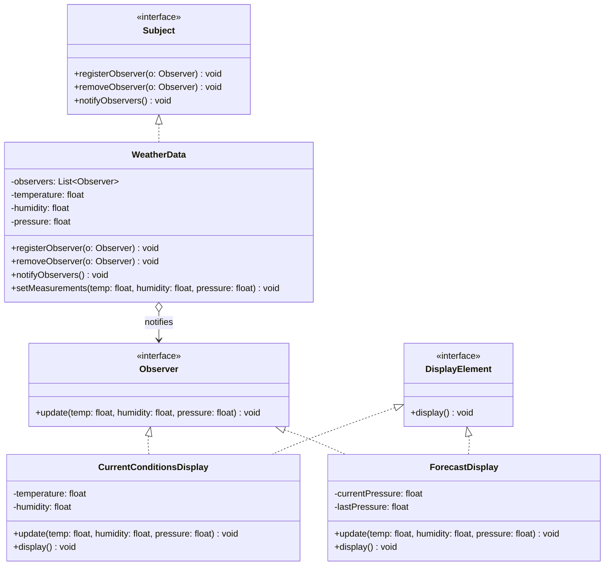

---

### 3. [Command](./Command/CommandPattern)
* **Intent:** Encapsulates a request as an object, thereby letting you parameterize clients with different requests, queue or log requests, and support undoable operations.
* **Real-World Billing Use-case:** Transaction rollbacks. Encapsulating invoicing/payment actions as Command objects (e.g., `ChargeCardCommand`, `UpdateLedgerCommand`) allows execution tracking, transaction logging, queueing, and a corresponding `undo()` for transactional recovery (rollbacks).
* **Key Classes:**
  - `Command` (Interface with `execute()` and `undo()`)
  - `LightOnCommand`, `LightOffCommand`, `StereoOnWithCDCommand`, `StereoOffCommand` (Concrete Commands)
  - `RemoteControl` (Invoker)
  - `Light`, `Stereo` (Receivers)

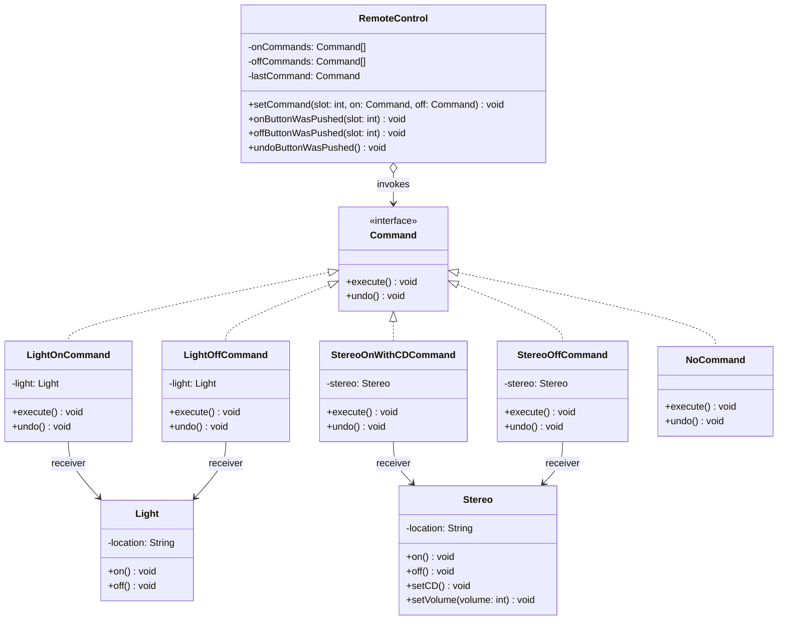

---

### 4. [Template Method](./Template%20Method/TemplateMethodPattern)
* **Intent:** Defines the skeleton of an algorithm in an operation, deferring some steps to subclasses. Template Method lets subclasses redefine certain steps of an algorithm without changing the algorithm's structure.
* **Real-World Billing Use-case:** Document export or parsing. An abstract `TaxReportExporter` defines a structured export sequence: `fetchTransactions()`, `calculateTax()`, `formatReport()`, and `writeOutput()`. Subclasses like `CsvTaxExporter` and `PdfTaxExporter` override only `formatReport()` and `writeOutput()`.
* **Key Classes:**
  - `DataParser` (Abstract template class)
  - `CsvDataParser`, `JsonDataParser` (Concrete implementations)

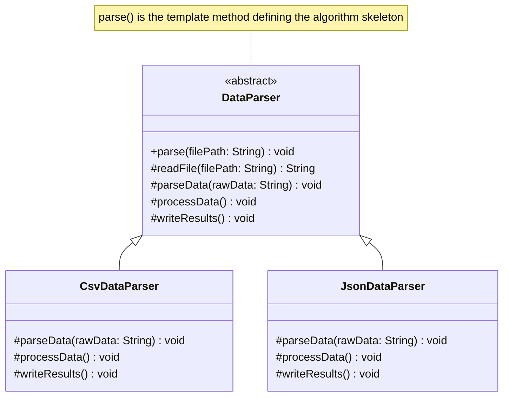

---

### 5. [Iterator](./Iterator/IteratorPattern)
* **Intent:** Provides a way to access the elements of an aggregate object sequentially without exposing its underlying representation.
* **Real-World Billing Use-case:** Processing transactional records. Traversing ledger logs, customer databases, or invoice items without exposing whether the underlying storage is an Array, ArrayList, or Hash Map.
* **Key Classes:**
  - `Iterator` (Custom iterator interface)
  - `DinerMenuIterator`, `PancakeHouseMenuIterator` (Concrete Iterators)
  - `Menu` (Aggregate interface)
  - `DinerMenu`, `PancakeHouseMenu` (Concrete Aggregates)
  - `Waitress` (Client)

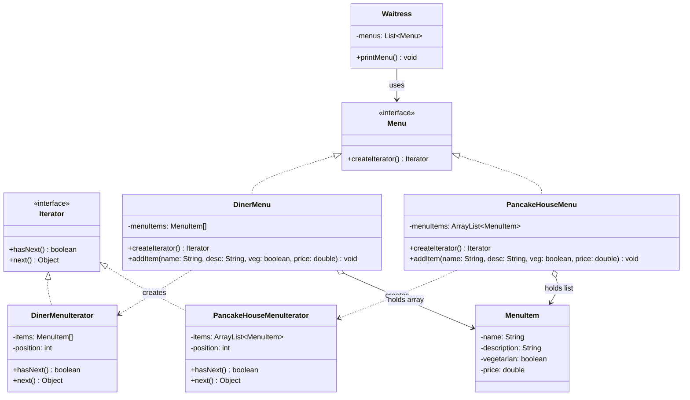

---

### 6. [State](./State/StatePattern)
* **Intent:** Allows an object to alter its behavior when its internal state changes. The object will appear to change its class.
* **Real-World Billing Use-case:** Invoice lifecycle management. An `Invoice` object changes behavior based on its current state: `DraftState` allows edits, `SentState` blocks edits and allows payments, `PaidState` blocks payments and allows refunds, and `VoidState` blocks all actions.
* **Key Classes:**
  - `State` (State interface)
  - `NoQuarterState`, `HasQuarterState`, `SoldState`, `SoldOutState` (Concrete States)
  - `GumballMachine` (Context)

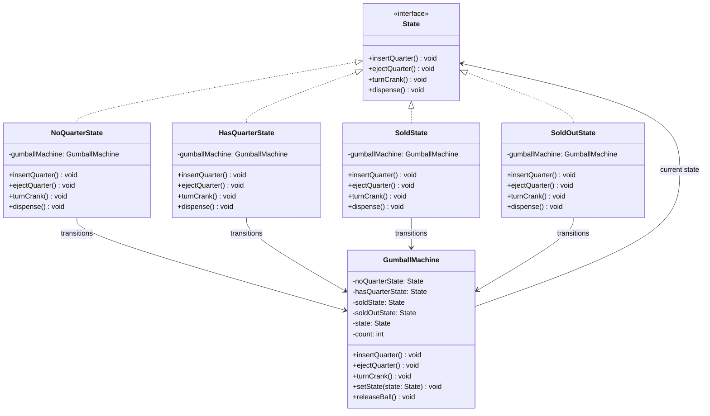

---

### 7. [Chain of Responsibility](./Chain%20of%20Responsibility/ChainOfResponsibilityPattern)
* **Intent:** Avoids coupling the sender of a request to its receiver by giving more than one object a chance to handle the request. Chains the receiving objects and passes the request along the chain until an object handles it.
* **Real-World Billing Use-case:** Invoice approval pipelines. A purchase invoice is routed through a chain: `TeamLead` (up to $500), `DepartmentHead` (up to $5,000), `CFO` (above $5,000). If the request amount exceeds the current handler's limit, it is automatically passed to the next approver in the chain.
* **Key Classes:**
  - `Approver` (Abstract Handler)
  - `Manager`, `Director`, `CEO` (Concrete Handlers)
  - `PurchaseRequest` (Request object)

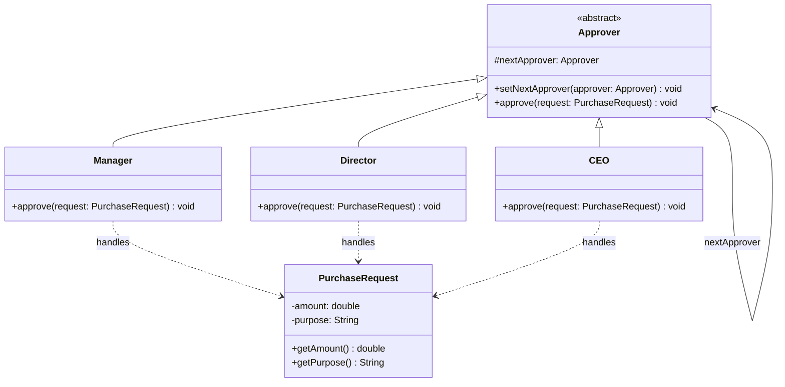

---

### 8. [Mediator](./Mediator/MediatorPattern)
* **Intent:** Defines an object that encapsulates how a set of objects interact. Mediator promotes loose coupling by keeping objects from referring to each other explicitly, and it lets you vary their interaction independently.
* **Real-World Billing Use-case:** Billing control room. A `BillingMediator` coordinates interaction between `UsageTracker`, `InvoiceGenerator`, `PaymentGateway`, and `CustomerNotifier`, keeping them decoupled from direct dependencies on one another.
* **Key Classes:**
  - `ChatMediator` (Mediator interface)
  - `ChatMediatorImpl` (Concrete Mediator)
  - `User` (Colleague abstract class)
  - `UserImpl` (Concrete Colleague)

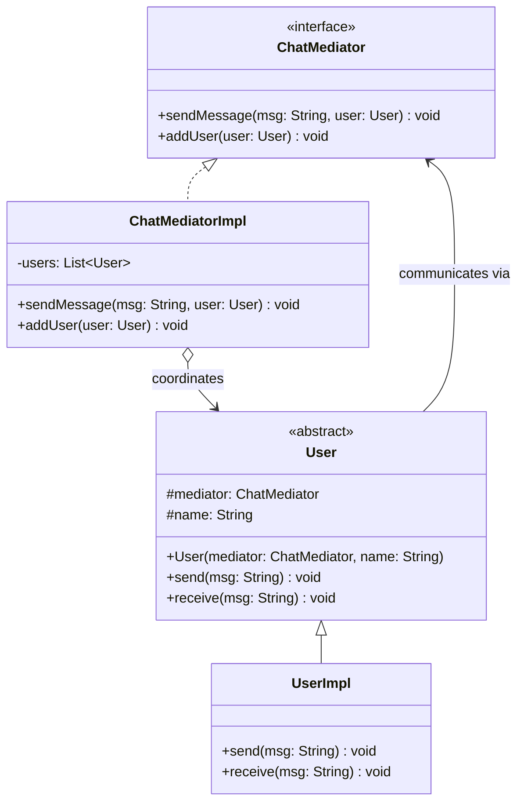

---

### 9. [Memento](./Memento/MementoPattern)
* **Intent:** Without violating encapsulation, captures and externalizes an object's internal state so that the object can be restored to this state later.
* **Real-World Billing Use-case:** Restoring invoice drafts. Saving checkpoints of an invoice being drafted so that users can rollback changes or revert to a previously saved draft version.
* **Key Classes:**
  - `Memento` (Stores immutable state snapshot)
  - `Originator` (Creates and restores from mementos)
  - `Caretaker` (Manages history stack of mementos)

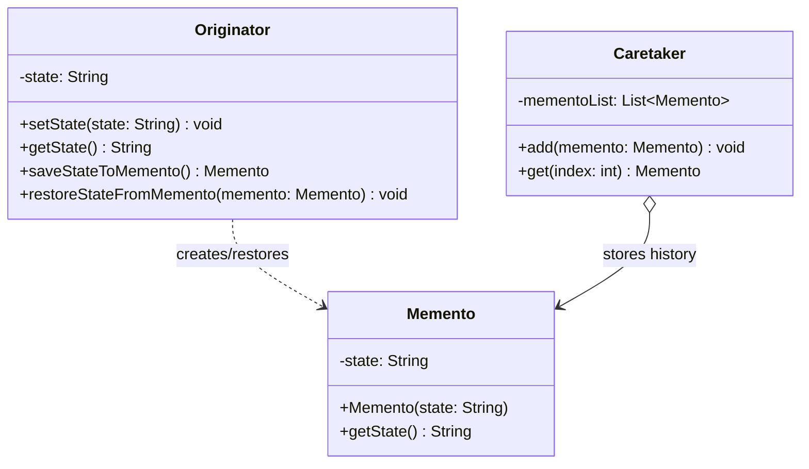

---

### 10. [Visitor](./Visitor/VisitorPattern)
* **Intent:** Represents an operation to be performed on the elements of an object structure. Visitor lets you define a new operation without changing the classes of the elements on which it operates.
* **Real-World Billing Use-case:** Applying regional tax and discount calculators. A `Visitor` traverses invoice items. Different visitors like `UsTaxVisitor` or `EuTaxVisitor` calculate taxes depending on item type (e.g., clothing, electronics) without altering the item classes themselves.
* **Key Classes:**
  - `ItemElement` (Visitable element interface)
  - `Book`, `Fruit` (Concrete visitable elements)
  - `ShoppingCartVisitor` (Visitor interface)
  - `ShoppingCartVisitorImpl` (Concrete Visitor)

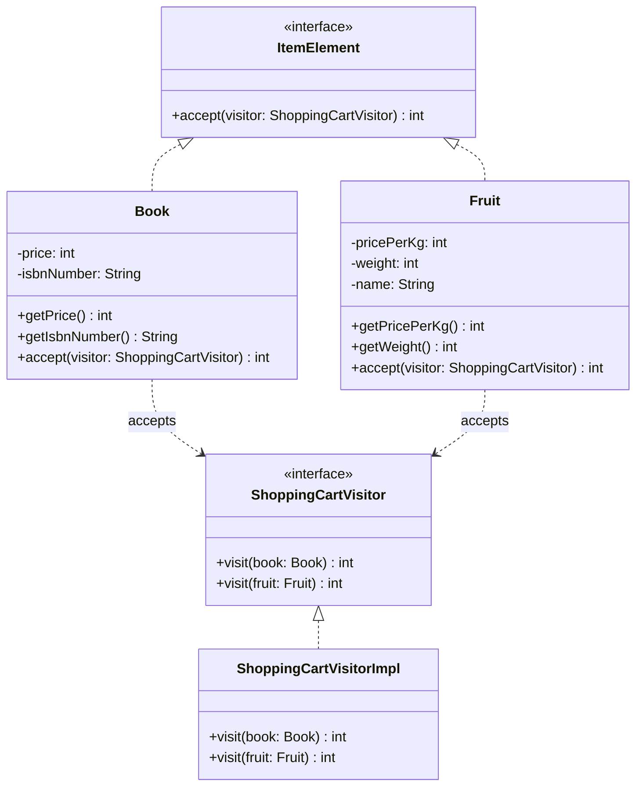

---

### 11. [Interpreter](./Interpreter/InterpreterPattern)
* **Intent:** Given a language, defines a representation for its grammar along with an interpreter that uses the representation to interpret sentences in the language.
* **Real-World Billing Use-case:** Parsing dynamic billing rules or discount formulas. Interpreting dynamic expressions (e.g., `(user.age > 60 && order.total > 100) ? discount = 0.10 : discount = 0`) configured by business users.
* **Key Classes:**
  - `Expression` (Abstract syntax tree node interface)
  - `NumberExpression` (Terminal Expression)
  - `PlusExpression`, `MinusExpression` (Non-Terminal Expressions)

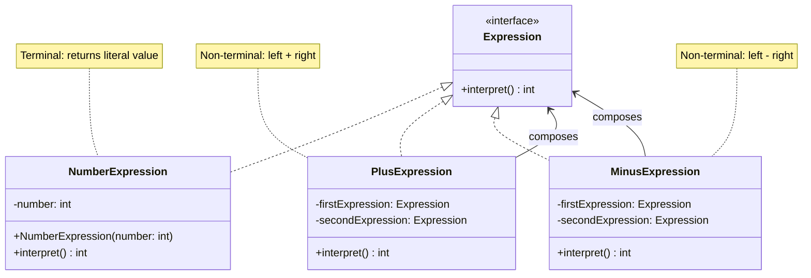

---

## 🎯 Behavioral Design Patterns Summary

| Pattern | Key Idea | How It Works |
| :--- | :--- | :--- |
| **Strategy** | Interchangeable algorithms | Context delegates to strategy object |
| **Observer** | Event notification | Broadcasts updates to list of subscribers |
| **Command** | Encapsulated request | Wraps request in object with `execute`/`undo` |
| **Template Method** | Step-by-Step skeleton | Parent skeleton, child fills specific steps |
| **Iterator** | Collection traversal | Iterates items without exposing container structure |
| **State** | Dynamic state-based behavior | Context delegates to current State state-class |
| **Chain of Responsibility** | Request passing | Passes request down a line of handlers |
| **Mediator** | Centralized communication | Many-to-many communication funneled through mediator |
| **Memento** | State checkpoints | Saves and restores state snapshots |
| **Visitor** | Operations on structures | Decouples algorithm from object structure |
| **Interpreter** | Parsing language rules | AST nodes evaluate grammar rules |
