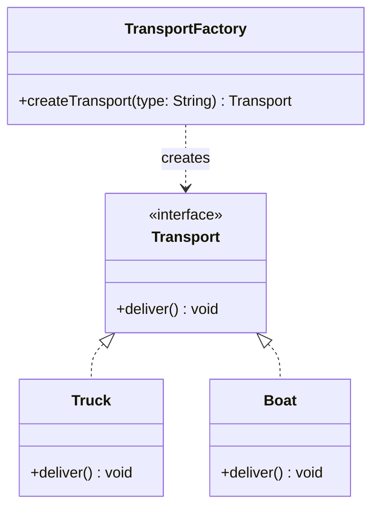
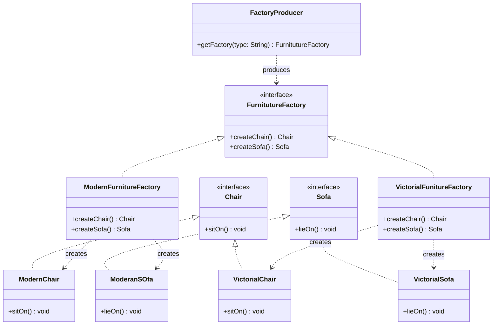
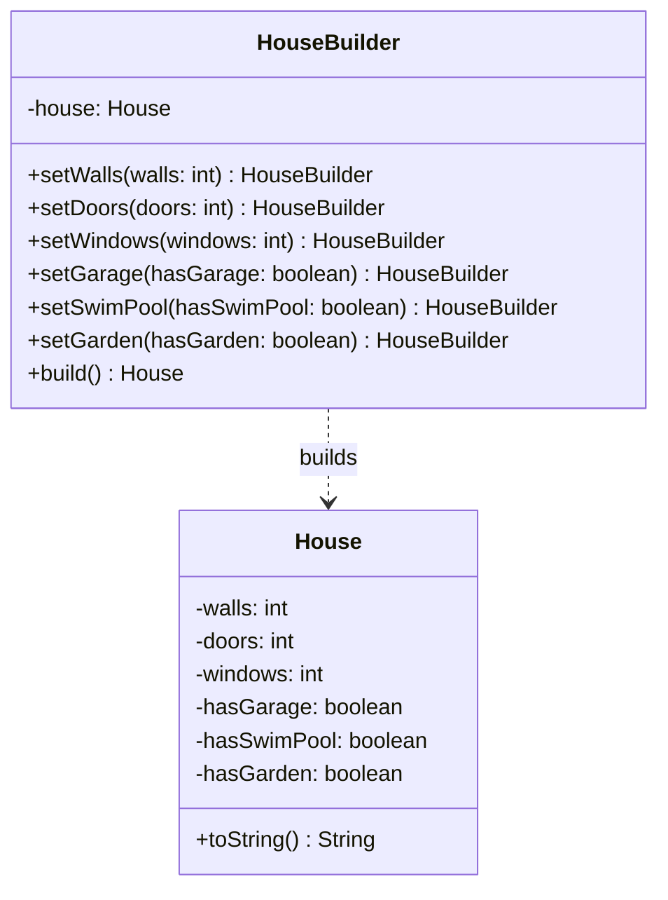
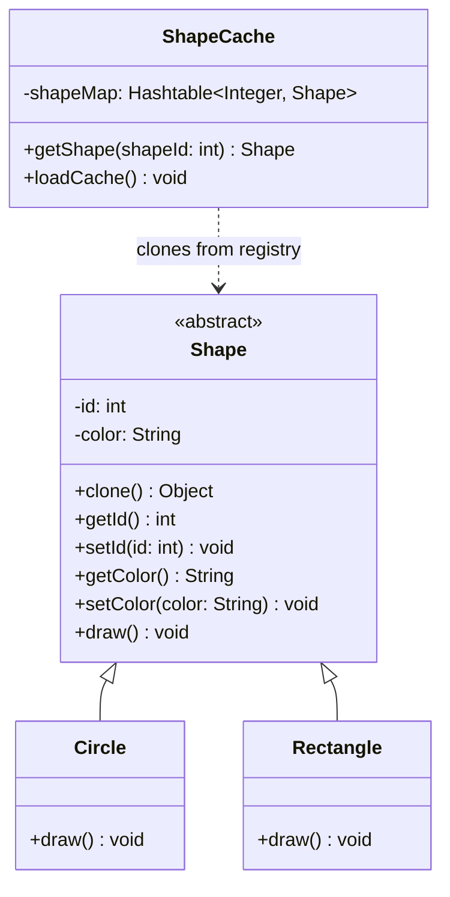
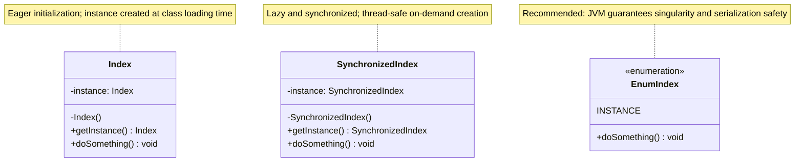

# Creational Design Patterns

Creational design patterns deal with object creation mechanisms, trying to create objects in a manner suitable to the situation. The basic form of object creation could result in design problems or added complexity to the design. Creational design patterns solve this problem by controlling this object creation.

---

## 🛠️ Included Patterns

### 1. [Factory Method](./Factory%20Method/FactoryMethod)
* **Intent:** Defines an interface for creating an object, but lets subclasses decide which class to instantiate. Factory Method lets a class defer instantiation to subclasses.
* **Real-World Billing Use-case:** Generating payment transactions. A billing platform might support multiple payment methods (Credit Card, Bank Transfer, PayPal). A `TransactionCreator` defines `createTransaction()`, and subclass creators like `CcTransactionCreator` and `PaypalTransactionCreator` instantiate their respective transaction models.
* **Key Classes:**
  - `Transport` (Product Interface)
  - `Truck`, `Boat` (Concrete Products)
  - `TransportFactory` (Creator)

---

### 2. [Abstract Factory](./Abstract%20Factory/AbstactFactory)
* **Intent:** Provides an interface for creating families of related or dependent objects without specifying their concrete classes.
* **Real-World Billing Use-case:** Supplying region-specific formatting engines (currency formatters, date formats, address layouts) for invoices. A `UsFormatFactory` creates a US currency formatter and a US address layout, while a `EuFormatFactory` creates Euro formatters and European address layouts.
* **Key Classes:**
  - `FurnitutureFactory` (Abstract Factory)
  - `ModernFurnitureFactory`, `VictorialFunitureFactory` (Concrete Factories)
  - `Chair`, `Sofa` (Abstract Products)
  - `ModernChair`, `VictorialChair` (Concrete Products)

---

### 3. [Builder](./Builder%20Pattern/BuilderPattern)
* **Intent:** Separates the construction of a complex object from its representation so that the same construction process can create different representations.
* **Real-World Billing Use-case:** Constructing a complex `Invoice` object. An invoice has mandatory fields (invoice ID, customer details, date) and multiple optional fields (discounts, tax breakdowns, purchase order numbers, line items). A builder ensures the `Invoice` is immutable once constructed and avoids "telescoping constructor" anti-patterns.
* **Key Classes:**
  - `House` (Product)
  - `HouseBuilder` (Builder)

---

### 4. [Prototype](./Prototype%20Pattern/PrototypePattern)
* **Intent:** Specifies the kinds of objects to create using a prototypical instance, and creates new objects by copying this prototype.
* **Real-World Billing Use-case:** Copying standard subscription plans or invoice templates. Rather than fetching pricing rules, tax parameters, and terms from the database every time a client subscribes to a standard "Enterprise Plan", a pre-constructed prototype is cloned and customized with the specific customer's details.
* **Key Classes:**
  - `Shape` (Prototype class implementing `Cloneable`)
  - `Circle`, `Rectangle` (Concrete Prototypes)
  - `ShapeCache` (Registry to store and retrieve prototypes)

---

### 5. [Singleton](./Singleton%20Design/SingletonDesign)
* **Intent:** Ensures a class has only one instance, and provides a global point of access to it.
* **Real-World Billing Use-case:** Globally coordinating thread-safe configurations (such as standard tax rates, exchange rate caches, or connection pools to the billing database).
* **Key Classes:**
  - `Index` (Eager/Classic Singleton)
  - `SynchronizedIndex` (Thread-safe Lazy Singleton)
  - `EnumIndex` (Enum-based Singleton - *highly recommended for production Java due to built-in serialization and thread safety*)

---

## 🎯 Creational Design Patterns Summary

| Pattern | Focus | Construction | Coupling |
| :--- | :--- | :--- | :--- |
| **Factory Method** | Single Object | Defer to Subclass | Low (interfaces only) |
| **Abstract Factory** | Families of Objects | Factory Composition | Low (abstract factories) |
| **Builder** | Complex Steps | Director / Step-by-Step | Medium (complex assemblies) |
| **Prototype** | Cloning state | Binary clone / copy | Low (needs prototype registry) |
| **Singleton** | Single instance | Static Access / Enum | High (global access point) |
