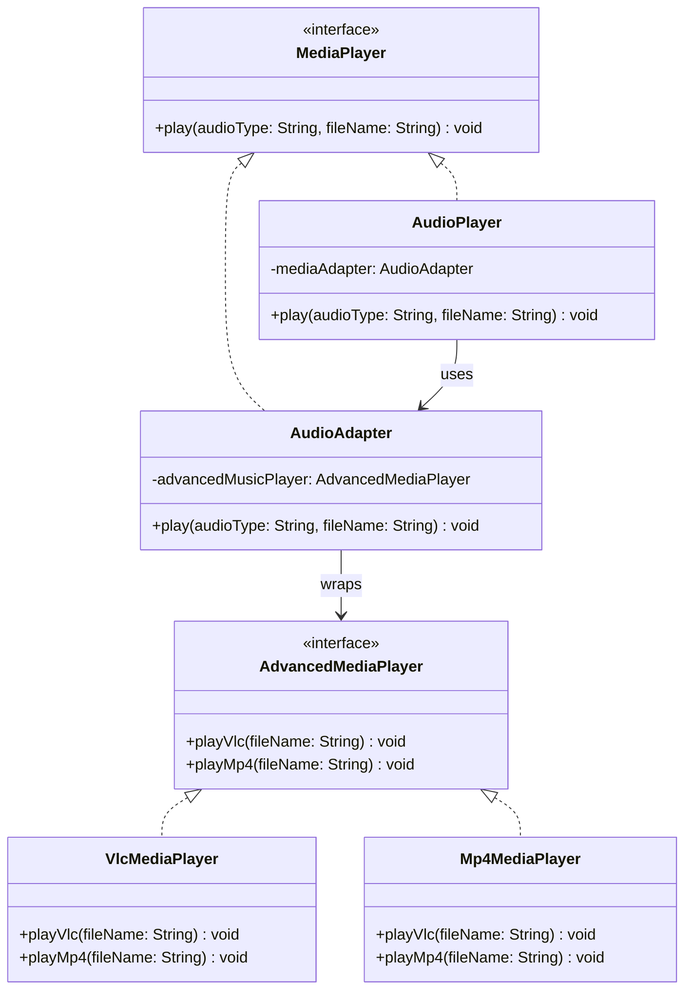
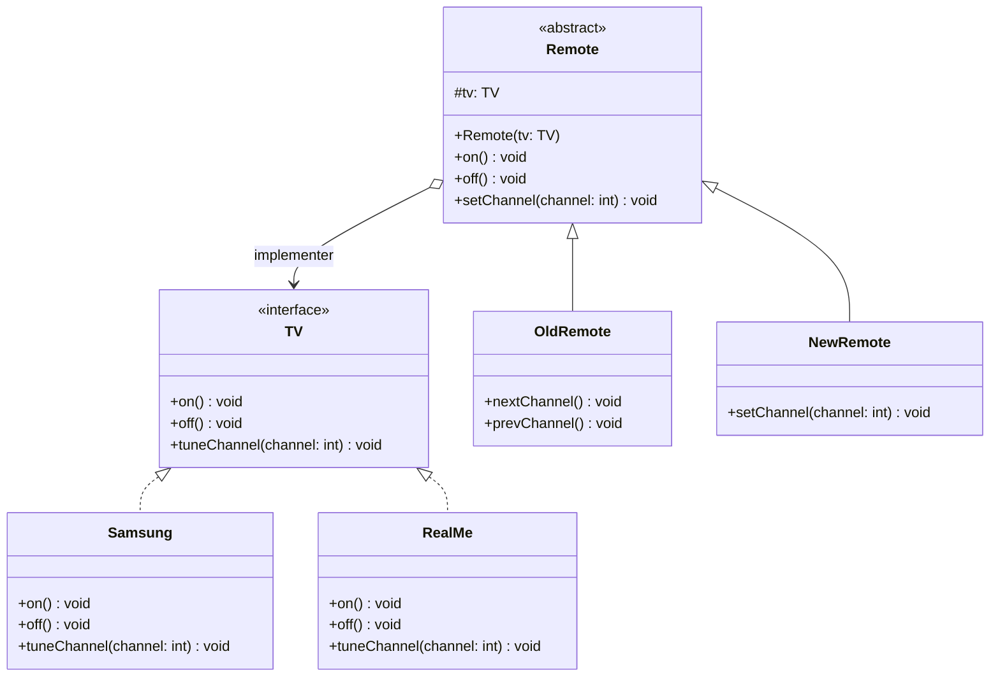
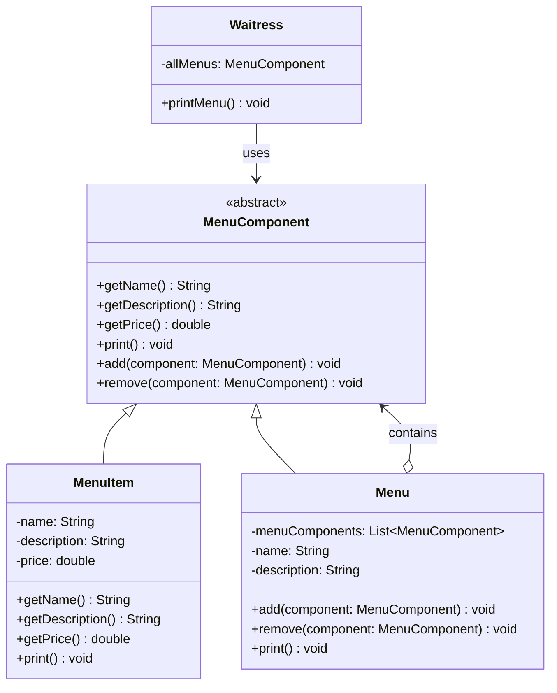
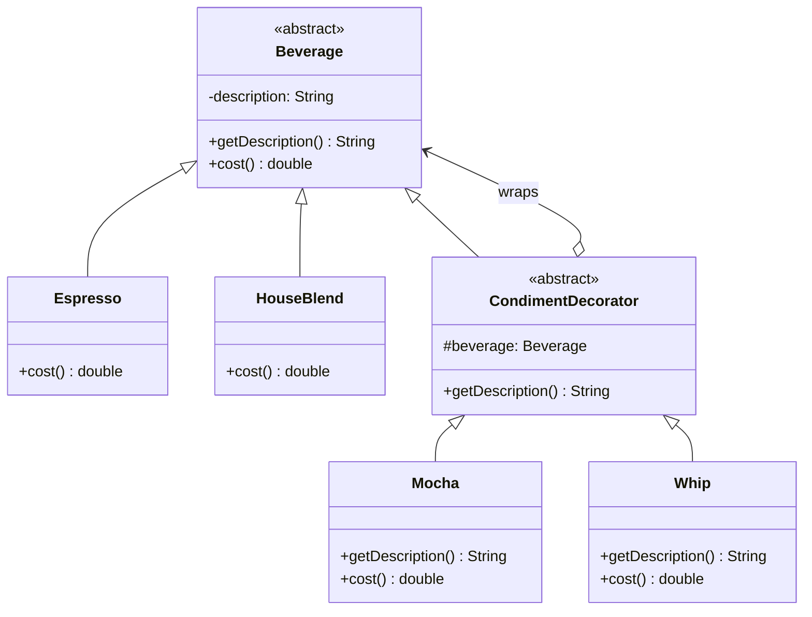
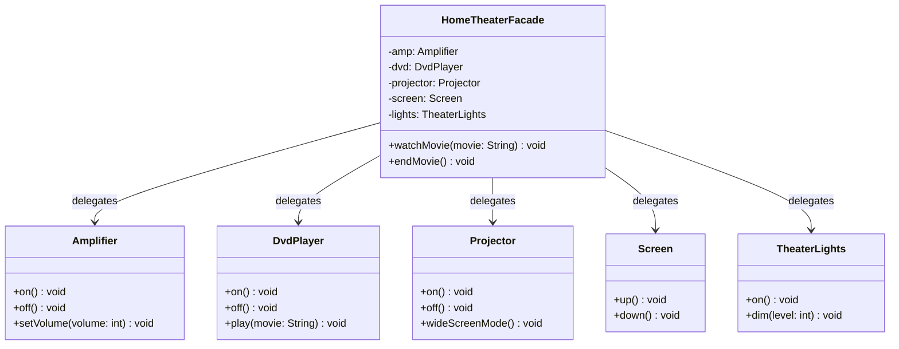
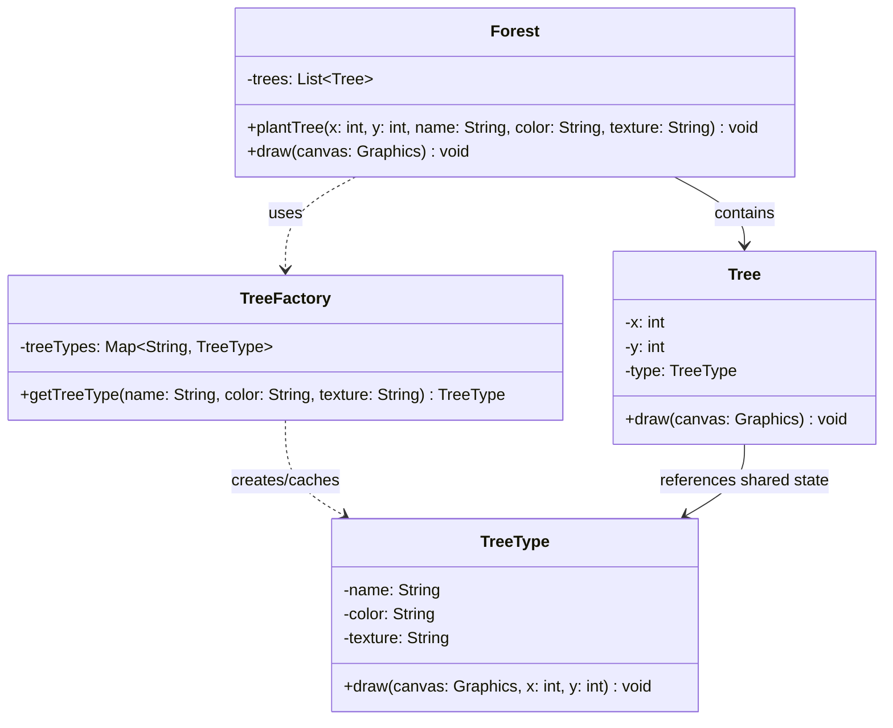
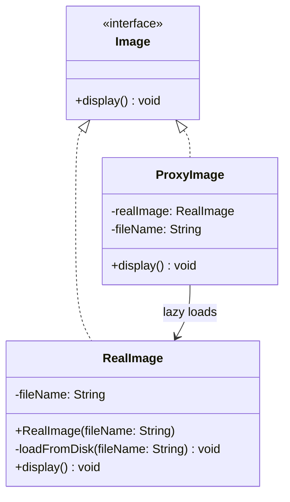

# Structural Design Patterns

Structural design patterns explain how to assemble objects and classes into larger structures, while keeping these structures flexible and efficient. They focus on simplifying relationships between entities.

---

## 🛠️ Included Patterns

### 1. [Adapter](./Adapter/AdapterPattern)
* **Intent:** Converts the interface of a class into another interface clients expect. Adapter lets classes work together that couldn't otherwise because of incompatible interfaces.
* **Real-World Billing Use-case:** Connecting to third-party payment gateways. Your system defines a standard `PaymentGateway` interface (with `charge()`, `refund()`). To use Stripe (which uses `StripeApi`) or PayPal (which uses `PaypalSdk`), you write `StripeAdapter` and `PaypalAdapter` classes mapping your interface to their SDK calls.
* **Key Classes:**
  - `MediaPlayer` (Target interface)
  - `AudioPlayer` (Client)
  - `AdvancedMediaPlayer` (Adaptee interface)
  - `Mp4MediaPlayer`, `VlcMediaPlayer` (Concrete Adaptees)
  - `AudioAdapter` (Adapter implementing Target and wrapping Adaptee)

---

### 2. [Bridge](./Bridge/BridgePattern)
* **Intent:** Decouples an abstraction from its implementation so that the two can vary independently.
* **Real-World Billing Use-case:** Generating invoices in different layouts and export formats. The abstraction `InvoiceExporter` (e.g., `DetailedInvoiceExporter`, `SummaryInvoiceExporter`) delegates to an implementer interface `ExportFormat` (e.g., `PdfExportFormat`, `CsvExportFormat`, `XmlExportFormat`). You can add new layouts or new formats independently without creating M × N class combinations.
* **Key Classes:**
  - `Remote` (Abstraction)
  - `OldRemote`, `NewRemote` (Refined Abstractions)
  - `TV` (Implementer interface)
  - `Samsung`, `RealMe` (Concrete Implementers)

---

### 3. [Composite](./Composite/CompositePattern)
* **Intent:** Composes objects into tree structures to represent part-whole hierarchies. Composite lets clients treat individual objects and compositions of objects uniformly.
* **Real-World Billing Use-case:** Modeling hierarchical product catalogs or composite invoices. For instance, a subscription invoice may consist of individual line items (e.g., base subscription fee) and composite items (e.g., standard bundle consisting of cloud storage, support fee, and API usage fees). The billing system calculates total cost by invoking `calculatePrice()` on the root nodes uniformly.
* **Key Classes:**
  - `MenuComponent` (Component interface)
  - `MenuItem` (Leaf node)
  - `Menu` (Composite node holding list of components)
  - `Waitress` (Client)

---

### 4. [Decorator](./Decorator/DecoratorPattern)
* **Intent:** Attaches additional responsibilities to an object dynamically. Decorators provide a flexible alternative to subclassing for extending functionality.
* **Real-World Billing Use-case:** Building a dynamic invoice billing decorator. A base invoice calculation can be dynamically decorated with `TaxDecorator`, `SeasonalDiscountDecorator`, `LateFeeDecorator`, or `CourierFeeDecorator`, adding costs or deductions transparently.
* **Key Classes:**
  - `Beverage` (Component interface)
  - `Espresso`, `HouseBlend` (Concrete Components)
  - `CondimentDecorator` (Decorator abstraction)
  - `Mocha`, `Whip` (Concrete Decorators)

---

### 5. [Facade](./Facade/FacadePattern)
* **Intent:** Provides a unified interface to a set of interfaces in a subsystem. Facade defines a higher-level interface that makes the subsystem easier to use.
* **Real-World Billing Use-case:** Organizing complex backend billing services. A client just calls `billingFacade.processMonthlyInvoice(customerId)`. Behind the scenes, the facade coordinates the `CustomerService`, `UsageTracker`, `TaxCalculator`, `InvoiceGenerator`, `PaymentGateway`, and `EmailNotificationService`.
* **Key Classes:**
  - `HomeTheaterFacade` (Facade class)
  - `Amplifier`, `DvdPlayer`, `Projector`, `Screen`, `TheaterLights` (Subsystem classes)

---

### 6. [Flyweight](./Flyweight/FlyweightPattern)
* **Intent:** Shares objects to support large numbers of fine-grained objects efficiently.
* **Real-World Billing Use-case:** Minimizing memory footprint for millions of micro-transactions. If millions of billing records contain repetitive transaction codes, currencies (e.g., USD, EUR), and tax rules, these shared elements can be encapsulated into Flyweights, referencing them inside lightweight context objects.
* **Key Classes:**
  - `TreeType` (Shared flyweight intrinsic state)
  - `TreeFactory` (Flyweight Factory)
  - `Tree` (Unshared extrinsic context)
  - `Forest` (Client)

---

### 7. [Proxy](./Proxy/ProxyPattern)
* **Intent:** Provides a surrogate or placeholder for another object to control access to it.
* **Real-World Billing Use-case:** Access control or lazy loading on database entities. A `BillingReportProxy` might delay the generation of a heavy quarterly audit report (Virtual Proxy) or verify user roles before granting access to sensitive invoice data (Protection Proxy).
* **Key Classes:**
  - `Image` (Subject interface)
  - `RealImage` (Real Subject)
  - `ProxyImage` (Proxy)

---

## 🎯 Structural Design Patterns Summary

| Pattern | Purpose | Relationship |
| :--- | :--- | :--- |
| **Adapter** | Converts interface | Unites incompatible interfaces |
| **Bridge** | Decouples interface/implementation | Bridges separate hierarchies |
| **Composite** | Handles tree structure | Uniformly treats leaves and groups |
| **Decorator** | Adds behaviors dynamically | Wraps object to extend functionality |
| **Facade** | Simplifies complex system | Unified single point of entry |
| **Flyweight** | Optimizes memory | Shares identical intrinsic states |
| **Proxy** | Intercepts access | Controls reference to underlying object |
